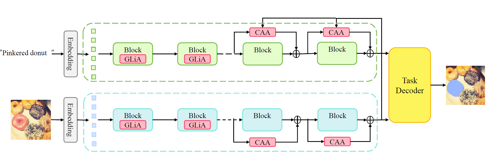
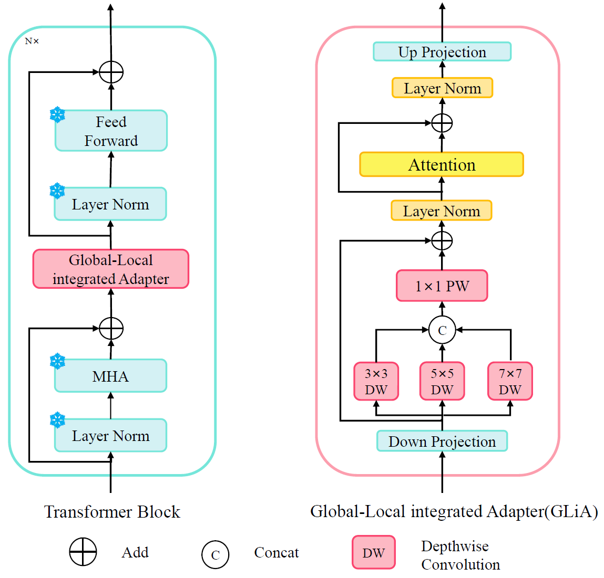
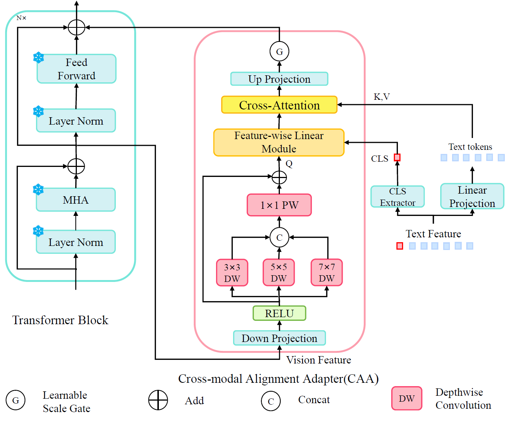

# MiCA

This is an official PyTorch implementation of [MiCA: Intra-Modal Integration and Cross-Modal Alignment Adapters for Parameter-Efficient Referring Image Segmentation](https://ieeexplore.ieee.org/document/11475681).

# Overall Architecture



# Adapter Modules

MiCA consists of two lightweight and complementary adapter designs. The Global-Local Integrated Adapter (GLIA) strengthens intra-modal representation learning by integrating local spatial details and global context within each modality. The Cross-Modal Alignment Adapter (CAA) explicitly enhances vision-language alignment through text-conditioned modulation and cross-modal interaction.

## Global-Local Integrated Adapter (GLIA)

GLIA is inserted into the backbone in a serial manner. It combines multi-scale depthwise convolution with lightweight attention, enabling the model to capture fine-grained local structures while preserving global contextual dependencies.

## Cross-Modal Alignment Adapter (CAA)

CAA is introduced as a parallel adapter for explicit cross-modal alignment. It employs feature-wise linear modulation (FiLM) and cross-modal attention to adapt visual features according to the referring expression, improving the semantic correspondence between language tokens and image regions.

<p align="center">
  
  
</p>

# Introduction

MiCA is a parameter-efficient transfer learning framework for Referring Image Segmentation (RIS). Instead of fully fine-tuning large vision-language backbones, MiCA updates lightweight adapter modules while keeping most pretrained parameters frozen.

The method addresses two key challenges in dense multimodal prediction: intra-modal feature integration and cross-modal semantic alignment. MiCA introduces two complementary adapters:

- **GLIA (Global-Local Integrated Adapter)** enhances intra-modal feature integration with multi-scale local modeling and global dependency capture.
- **CAA (Cross-Modal Alignment Adapter)** improves cross-modal alignment by conditioning visual adaptation on language semantics.

## Highlights

- **Parameter efficient**: MiCA updates only about **1.93%** of the backbone parameters in the base setting.
- **Strong RIS performance**: MiCA achieves state-of-the-art results on RefCOCO, RefCOCO+, and G-Ref while remaining more efficient than full fine-tuning.
- **Efficient training and inference**: the decoupled sparse integration and single-insertion design reduce computation and memory overhead.
- **Good generalization**: the learned adapter design also transfers to zero-shot and supervised referring expression comprehension (REC) settings.

# Preparation

## Environment

```bash
conda create -n MiCA python=3.9.18 -y
conda activate MiCA
pip install torch==2.0.1 torchvision==0.15.2 torchaudio==2.0.2
pip install -r requirement.txt
```

## Datasets

MiCA uses the standard RIS datasets: RefCOCO, RefCOCO+, and G-Ref. Please prepare the datasets following [`tools/prepare_datasets.md`](tools/prepare_datasets.md). Dataset files are not included in this repository.

## Pretrained Weights

Download the pretrained DiNOv2 and CLIP weights before training:

```bash
mkdir pretrain && cd pretrain

## DiNOv2-B
wget https://dl.fbaipublicfiles.com/dinov2/dinov2_vitb14/dinov2_vitb14_reg4_pretrain.pth

## DiNOv2-L
wget https://dl.fbaipublicfiles.com/dinov2/dinov2_vitl14/dinov2_vitl14_reg4_pretrain.pth

## ViT-B
wget https://openaipublic.azureedge.net/clip/models/5806e77cd80f8b59890b7e101eabd078d9fb84e6937f9e85e4ecb61988df416f/ViT-B-16.pt
```

Pretrained weights and trained checkpoints are not tracked by Git. Please place them under `pretrain/` or provide the checkpoint path when evaluating.

# Quick Start

To train MiCA, modify the script according to your dataset, config, and GPU settings, then run:

```
bash run_scripts/train.sh
```

If you want to use multi-GPU training, modify `gpu` in `run_scripts/train.sh`. Please execute this script under the first-level directory, i.e., the directory containing `train.py`.

To evaluate MiCA, specify the model checkpoint path in `run_scripts/test.sh`, then run:

```
bash run_scripts/test.sh
```

If you want to visualize the results during evaluation, modify `visualize` to `True` in the config file.

## Training

A typical direct training command is:

```bash
torchrun --nproc_per_node=4 --master_port=29597 \
  train.py \
  --config config/refcoco/MiCA_base.yaml
```

Training logs and checkpoints are saved under `exp/` by default. The `exp/` directory is ignored by Git.

## Evaluation

A typical direct evaluation command is:

```bash
CUDA_VISIBLE_DEVICES=0 python3 -u test.py \
  --config config/refcoco/MiCA_base.yaml \
  --path /path/to/best_model.pth \
  --opts TEST.test_split testB \
         TEST.test_lmdb datasets/lmdb/refcoco/testB.lmdb \
         DATA.dataset refcoco \
         DATA.mask_root datasets/masks/refcoco
```

## Demo

Use the following command to visualize the segmentation mask for your own image and expression:

```shell
python demo.py \
  --config config/refcoco/MiCA_base.yaml \
  --ckpt /path/to/best_model.pth \
  --img_path img/piece.png \
  --input_text "left piece slice" \
  --save_path img/left_piece_result.png
```

## Code Map

- `model/serial_adapter.py`: GLIA-style intra-modal adapter with multi-scale depthwise convolution and lightweight attention.
- `model/adapter.py`: CAA-style cross-modal adapter with FiLM modulation and cross-modal attention.
- `model/segmenter.py`: main segmentation model that integrates visual backbone, text backbone, decoder, and adapters.
- `config/`: training and evaluation configurations for RefCOCO, RefCOCO+, and G-Ref.
- `run_scripts/`: example scripts for training and evaluation.
- `tools/`: dataset preparation and conversion utilities.

## Results

Detailed benchmark tables and trained model links will be released soon.

# Acknowledgements

This codebase builds upon and benefits from the excellent open-source projects [DETRIS](https://github.com/jiaqihuang01/DETRIS), [MONA](https://github.com/Leiyi-HU/mona), [CRIS](https://github.com/DerrickWang005/CRIS.pytorch), [ETRIS](https://github.com/kkakkkka/ETRIS), and [DiNOv2](https://github.com/facebookresearch/dinov2). We sincerely thank the authors for making their code available to the community.

# Citation

If MiCA is useful for your research, please consider citing:

```bibtex
@article{li2026mica,
  title={MiCA: Intra-Modal Integration and Cross-Modal Alignment Adapters for Parameter-Efficient Referring Image Segmentation},
  author={Li, Yang and Feng, Ziteng and Wang, Tingrui and Wang, Chenyu and Zhou, Xin},
  journal={IEEE Transactions on Circuits and Systems for Video Technology},
  year={2026}
}
```

## License

This project is released under the MIT License. See [`LICENSE`](LICENSE) for details.
